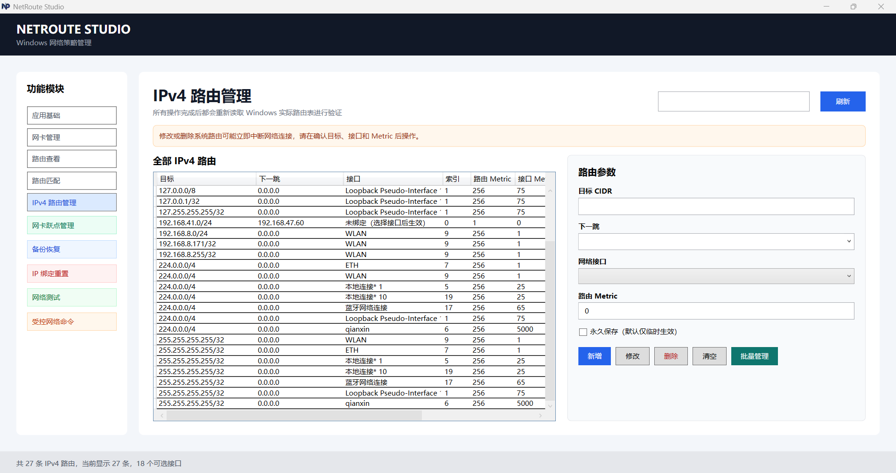
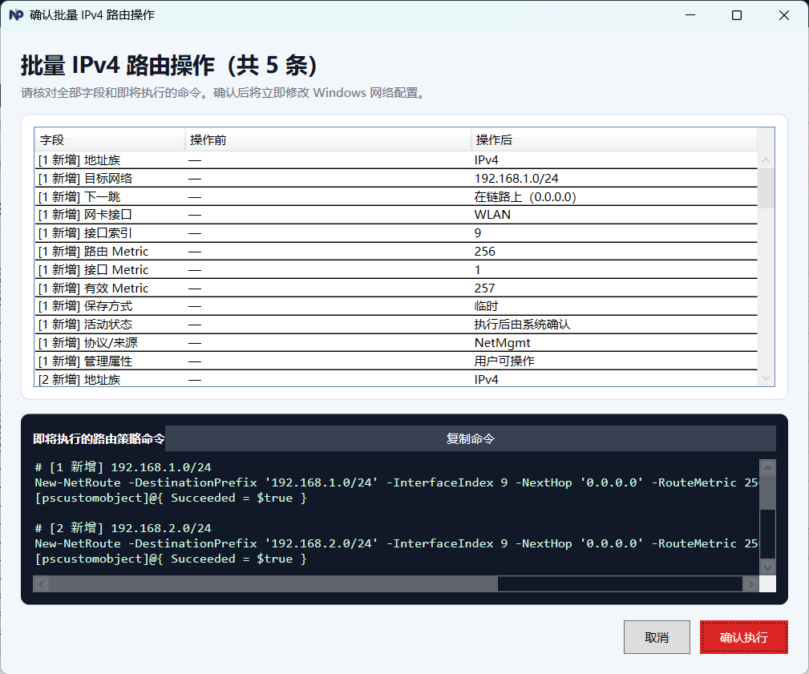

# NetRoute Studio

NetRoute Studio 是基于 .NET 8 与 WPF 开发的 Windows 可视化网络策略管理工具，提供网卡、路由、接口跃点、备份恢复、协议绑定重置和网络诊断能力。

## 功能模块

- 应用基础：依赖注入、日志、管理员权限检测和全局异常处理。
- 网卡管理：查看物理/虚拟网卡、IPv4/IPv6 地址、DNS、网关、状态和接口 Metric。
- 路由查看：分页查看和搜索 IPv4/IPv6 路由。
- 路由匹配：计算目标 IP 或域名的命中路由，并与 Windows 原生结果交叉验证。
- IPv4 路由管理：单条及批量新增、修改、删除，支持临时、永久和在链路上路由。
- 网卡跃点管理：查看和设置 IPv4/IPv6 自动或手动接口 Metric。
- 备份恢复：使用带版本、主机信息和校验摘要的 JSON 备份，对比并选择性恢复路由差异。
- IP 绑定重置：安全重置所选网卡的 IPv4（`ms_tcpip`）或 IPv6（`ms_tcpip6`）绑定。
- 网络测试：DNS、Ping、路由命中及 Tracert 诊断。
- 受控网络命令：白名单、参数校验、实时输出、取消、历史记录和 Telnet 端口测试。

## 程序截图

首页



批量管理




## 运行要求

- Windows 10 或 Windows 11 x64
- 框架依赖发布包需要 .NET 8 Desktop Runtime
- 修改路由、接口 Metric 或协议绑定时需要管理员权限
- Telnet 命令需要启用 Windows Telnet Client 可选功能

建议右键选择“以管理员身份运行”。只读页面可在非管理员模式下使用，但部分网络接口可能因系统权限策略无法读取。

## 安全说明

- 修改或删除路由、重置协议绑定可能立即中断网络连接。
- 修改操作提供命令预览、确认和结果验证。
- 受控命令默认启用白名单；关闭仅在当前窗口有效，且仍禁止命令解释器、脚本宿主、路径启动和连接/重定向字符。
- 路由备份包含主机及网络配置信息，请妥善保管。

## 本地源码开发

### 必装工具

- Windows 10/11 x64。
- [Git for Windows](https://git-scm.com/download/win)。
- [.NET 8 SDK](https://dotnet.microsoft.com/download/dotnet/8.0)，注意 SDK 与仅运行程序所需的 Desktop Runtime 不同。
- Windows PowerShell 5.1，Windows 10/11 默认自带。应用使用其中的 `NetTCPIP`、`NetAdapter` 等系统模块。

可选开发工具：

- Visual Studio 2022，安装“.NET 桌面开发”工作负载。
- Visual Studio Code，并安装 C# Dev Kit。
- JetBrains Rider。

Telnet 仅在测试 Telnet 命令时需要。可在“启用或关闭 Windows 功能”中勾选“Telnet Client”。

### 检查开发环境

```powershell
git --version
dotnet --info
$PSVersionTable.PSVersion
Get-Module -ListAvailable NetTCPIP, NetAdapter
```

`dotnet --info` 应显示 .NET SDK 8.x；如果只有 Runtime 而没有 SDK，则无法从源码构建。

### 获取源码和恢复依赖

```powershell
git clone https://github.com/dwwangzz/netroute-studio.git
Set-Location netroute-studio
dotnet restore NetRouteStudio.sln --configfile NuGet.Config --disable-parallel
```

首次恢复需要访问 NuGet。恢复成功后，普通构建和测试可以使用 `--no-restore` 避免重复下载依赖。

### 从源码启动

普通权限启动：

```powershell
dotnet run --project src/NetRouteStudio.App/NetRouteStudio.App.csproj --configuration Debug --no-restore
```

只读查看和诊断功能可以使用普通权限。测试路由、接口 Metric 和协议绑定修改功能时，建议先构建，再以管理员权限启动：

```powershell
dotnet build NetRouteStudio.sln --no-restore --configuration Debug --maxcpucount:1
Start-Process `
  -FilePath "src/NetRouteStudio.App/bin/Debug/net8.0-windows/NetRouteStudio.App.exe" `
  -Verb RunAs
```

程序运行时会锁定 `bin` 目录中的 EXE/DLL。重新构建前请先关闭 NetRoute Studio。

### 构建

```powershell
# Debug
dotnet build NetRouteStudio.sln --no-restore --configuration Debug --maxcpucount:1

# Release
dotnet build NetRouteStudio.sln --no-restore --configuration Release --maxcpucount:1
```

项目固定使用单个 MSBuild 节点，以避免部分 Windows 环境并行构建 WPF 时出现调度异常。

### 运行测试

运行不依赖外部网络环境的稳定测试，与 GitHub CI 和 Release 门禁一致：

```powershell
dotnet test NetRouteStudio.sln --no-build --configuration Release --maxcpucount:1 --filter "Category!=Integration"
```

运行全部测试，包括读取本机真实网卡、路由、DNS 和公网状态的集成测试：

```powershell
dotnet test NetRouteStudio.sln --no-build --configuration Release --maxcpucount:1
```

只运行真实网络集成测试：

```powershell
dotnet test NetRouteStudio.sln --no-build --configuration Release --maxcpucount:1 --filter "Category=Integration"
```

运行指定测试类，例如路由匹配测试：

```powershell
dotnet test NetRouteStudio.sln --no-build --configuration Release --maxcpucount:1 --filter "FullyQualifiedName~RouteMatchServiceTests"
```

真实网络集成测试会读取当前 Windows 网卡、路由和 DNS，并可能访问公网。没有 IPv6 路由、DNS 受限或处于隔离网络时，集成测试可能失败；这类测试不会作为 GitHub Release 的阻断条件。

### 本地发布

框架依赖版（目标电脑需要 .NET 8 Desktop Runtime）：

```powershell
dotnet restore src/NetRouteStudio.App/NetRouteStudio.App.csproj --configfile NuGet.Config --runtime win-x64 --disable-parallel
dotnet publish src/NetRouteStudio.App/NetRouteStudio.App.csproj --no-restore --configuration Release --runtime win-x64 --self-contained false --output artifacts/release/NetRouteStudio-1.0.5-win-x64
```

自包含版（目标电脑无需安装 .NET）：

```powershell
dotnet publish src/NetRouteStudio.App/NetRouteStudio.App.csproj --no-restore --configuration Release --runtime win-x64 --self-contained true --output artifacts/release/NetRouteStudio-1.0.5-win-x64-self-contained
```

本地生成安装 EXE 还需要安装 [Inno Setup 6](https://jrsoftware.org/isdl.php)。先将自包含输出目录指定为 `artifacts/publish`，再执行：

```powershell
& "${env:ProgramFiles(x86)}\Inno Setup 6\ISCC.exe" `
  "/DMyAppVersion=1.0.5" `
  "/DNumericVersion=1.0.5.0" `
  "/DSourceDir=$((Resolve-Path 'artifacts/publish').Path)" `
  "/DOutputDir=$((Resolve-Path 'artifacts').Path)" `
  "installer\NetRouteStudio.iss"
```

输出文件为 `artifacts\NetRouteStudio-v1.0.5-win-x64-setup.exe`。

### 常见问题

- `dotnet` 命令不存在：安装 .NET 8 SDK，重新打开终端。
- NuGet 恢复失败：检查网络、代理和 `NuGet.Config`，确认可以访问 `https://api.nuget.org/v3/index.json`。
- `Get-NetRoute`、`Get-NetIPInterface` 或 CIM 返回“拒绝访问”：以管理员身份运行应用或集成测试终端。
- 构建提示 EXE/DLL 正在使用：关闭运行中的 NetRoute Studio 后重新构建。
- 真实域名或 IPv6 测试失败：检查 Runner/本机的 DNS 和 IPv6 网络，日常开发可先运行稳定测试。
- Telnet 提示未安装：在 Windows 可选功能中启用 Telnet Client。

## 日志与版本

日志写入 `%LOCALAPPDATA%\NetRouteStudio\logs`，按天滚动并保留 14 个文件。

当前稳定版本：`1.0.5`。详细变化见 [CHANGELOG.md](CHANGELOG.md)。

## GitHub Actions 发布

- `ci.yml`：推送到 `master`/`main` 或创建 Pull Request 时执行 Release 构建和稳定测试，不生成发布包。
- `release.yml`：仅在推送 `v*` 标签或手动发布时执行稳定测试、自包含打包、SHA-256 和 GitHub Release。
- `integration.yml`：手动或每周运行依赖真实 Windows 网卡、路由、DNS 和公网的集成测试；外部网络限制导致的失败不会阻止发布。

正式 Release 同时包含：

- `NetRouteStudio-vX.Y.Z-win-x64-self-contained.zip`：免安装自包含版。
- `NetRouteStudio-vX.Y.Z-win-x64-setup.exe`：Inno Setup 安装版，包含开始菜单、可选桌面快捷方式和卸载入口。
- 两个发布文件各自对应的 `.sha256` 校验文件。

```powershell
git tag v1.0.5
git push origin v1.0.5
```
